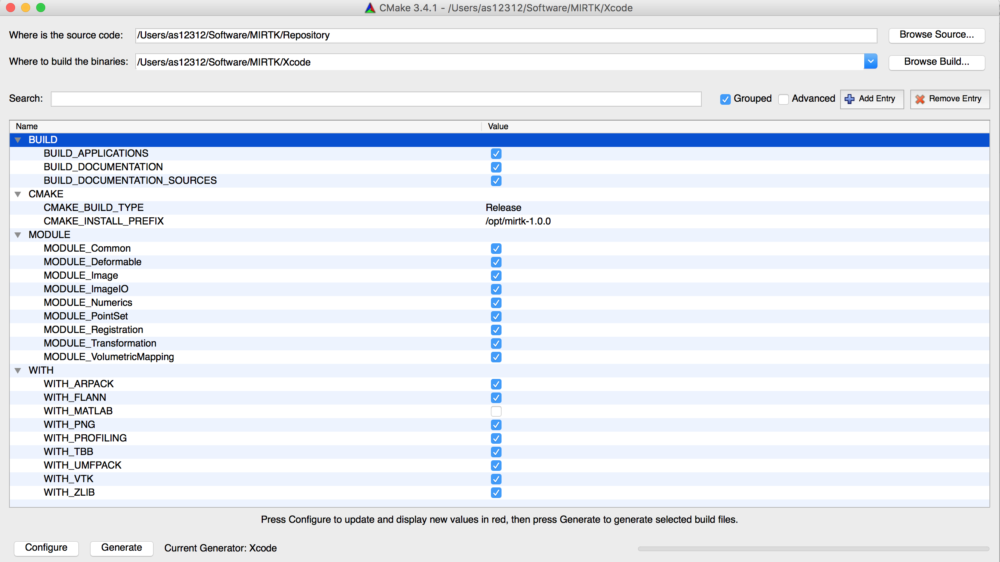
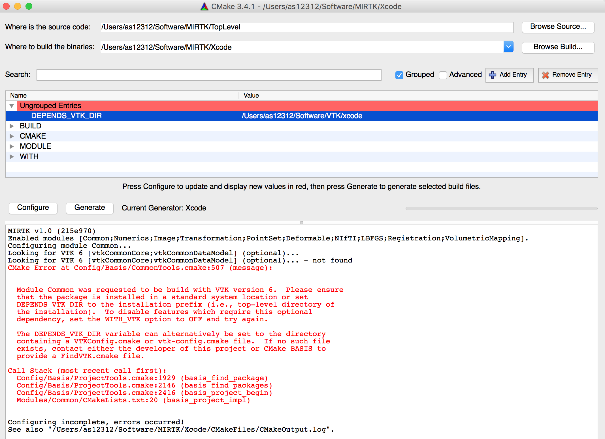

.. meta::
    :description: Build and installation instructions for the MIRTK.
    :keywords:    MIRTK installation, MIRTK dependencies

============
Installation
============

.. _BuildRequirements:

Requirements
============

For the generation of build environment specific build configuration files,
the Cross-platform Make tool named CMake_ is needed. The minimum required version
for Linux and OS X is 2.8.12, while version 3.4 or newer is needed on Windows.

For the compilation of the MIRTK source code, a C++ compiler with support for the
`C++11`_ standard is required. On Windows, the minimum required Visual Studio compiler
version is 18.0. A compatible compiler is shipped with Visual Studio 2013 or newer.
For Unix operation systems, we recommend the use of the `GNU Compiler Collection`_ (GCC).

To execute the :doc:`MIRTK commands <commands>`, a Python_ installation is required.
Note that Python has to be installed before configuring the MIRTK build using CMake.

.. _BuildDependencies:

Dependencies
============

.. include:: modules/_refs.rst

The MIRTK source code makes use of the following third-party libraries:

====================  =======  =======================  =============================================  ==================
Third-party library   Version  Included as              Required by module(s)                          Optionally used by
====================  =======  =======================  =============================================  ==================
`Intel TBB`_          any      System                   No module                                      All modules
Boost_                1.48     System                   |Numerics|, |PointSet|, |Transformation|
Eigen_                3.0      System                   |Numerics|, |Mapping|
ARPACK_ / UMFPACK_    any      System                   No module                                      |Numerics|
VTK_                  6.0      System                   |PointSet|, |Deformable|, |Mapping|            |Common|, |Image|, |Registration|
libpng_               any      System                   No module                                      |Image|
NiftiCLib_            any      System or Source code    No module                                      |IO|
libLBFGS_             any      Source code              No module                                      |IO|
====================  =======  =======================  =============================================  ==================

Boost_ and Eigen_ are a minimum requirement to build MIRTK. The source code of the NiftiCLib_ and
libLBFGS_ libraries are included in the basic download package and need not be installed.
The WITH_NiftiCLib build option can be used, however, to force the use of an existing NiftiCLib
installation. See :ref:`build configuration steps below <ConfigurationSteps>`.

The UMFPACK library is part of the `SuiteSparse <http://faculty.cse.tamu.edu/davis/suitesparse.html>`__ installation.

The intra-module dependencies are as follows. When a module is enabled,
all modules required by this module are automatically enabled as well.

===================  ===========================================================   ========================================
Module               Requires module(s)                                            Optionally uses module(s)
===================  ===========================================================   ========================================
|Common|             No other module
|Numerics|           |Common|
|Image|              |Common|, |Numerics|
|IO|                 |Image|
|Transformation|     |Common|, |Numerics|, |Image|
|PointSet|           |Common|, |Numerics|, |Image|, |Transformation|
|Registration|       |Common|, |Numerics|, |Image|, |Transformation|               |PointSet|, |Deformable|
|Deformable|         |Common|, |Numerics|, |Image|, |Transformation|, |PointSet|
|Mapping|            |Common|, |Numerics|, |Image|, |PointSet|
|Scripting|
|DrawEM|             |Common|, |Numerics|, |Image|, |IO|
===================  ===========================================================   ========================================

.. note::

   Notice that the |IO| module is required only by the :doc:`commands` which read/write images or point sets.

   For a complete list of module dependencies, see the BasisProject.cmake file and in
   some cases also the config/Depends.cmake file if present in the respective module directory.

.. _ConfigurationSteps:

Configuration
=============

CMake GUI Example
-----------------

After obtaining a copy of the MIRTK source files, generate the build configuration
files for your build tool of choice using CMake_.
We recommend the use of the CMake GUI with the "Grouped" checkbox enabled.
Advanced options should normally not be required to be modified.

An example screenshot of a CMake configuration is shown below.

Step-by-step
------------

1. **Set source code and build directory paths.**
   
   For the build directory path, a subdirectory within the MIRTK source
   directory named "Build" is recommended.
   
2. **Click "Configure" to initialize the build system.**
   
   CMake will ask for the build tool for which configuration files are to be generated.
   For Linux, the Makefile (i.e., GNU Make), Ninja, or CodeBlocks/Qt Creator
   generators are recommended. On OS X, the Xcode generator should be selected.

3. **Enable/disable MIRTK Modules to be build and features to be enabled.**

   Which :doc:`modules <modules>` are enabled is specified by the MODULE family of options.
   Optional library features are enabled by forcing the use of the respective
   external libraries required by the implementation of the feature using
   the WITH family of options. After the change of an option or other CMake
   variable, re-configure the build system by clicking on "Configure" again
   until no further changes are made and the "Generate" button is enabled.

   ============================  ======================================================
   Option/Variable               Description
   ============================  ======================================================
   BUILD_APPLICATIONS            Build command-line tools of enabled modules.
   BUILD_DOCUMENTATION           Configure build of online documentation ("doc" target).
   BUILD_DOCUMENTATION_SOURCES   (Re-)generate .rst source files of auto-generated pages.
   BUILD_TESTING                 Build the regression tests. (advanced, unused)
   CMAKE_BUILD_TYPE              Build configuration (e.g. "Release" for optimized code).
   CMAKE_INSTALL_PREFIX          Installation directory (default on Linux and OS X is `/opt/mirtk-<version>`).
   PYTHON_EXECUTABLE             Python_ executable used for execution of Python scripts.
   WITH_ARPACK                   Enable eigendecomposition of sparse matrices. Required for spectral surface matching.
   WITH_FLANN                    Use the Fast Library for Approximate Nearest Neighbors to locate points.
   WITH_MATLAB                   Enable output of matrices to .mat files and use of MATLAB functions.
   WITH_NiftiCLib                Force use of existing system installation of NiftiCLib_.
   WITH_PNG                      Enable writing of 2D images in PNG_ file format.
   WITH_PROFILING                Enable profiling of code execution to find runtime bottlenecks.
   WITH_TBB                      Enable multi-threaded execution using Intel Threading Building Blocks. (recommended)
   WITH_UMFPACK                  Automatically enabled when WITH_ARPACK is ON.
   WITH_VTK                      Enable processing of VTK files. Automatically enabled when PointSet module is enabled.
   WITH_ZLIB                     Enable reading/writing of compressed files using zlib_. (recommended)
   ============================  ======================================================

5. **Generate build tool configuration files.**

   When done, click the "Generate" button to write the configuration
   files for the build tool selected in step 2.

.. note:: Enabling a module may require additional external libraries or add
          further WITH options. The location of required external libraries is
          specified by the DEPENDS family of variables. These are marked as advanced
          and hence hidden from the default view when an installation of the external
          library was found automatically. To see which external libraries the MIRTK
          will be linked with, enable the "Advanced" checkbox at the top of the CMake GUI.

Dependency not found
--------------------

When a :ref:`build dependency <BuildDependencies>` such as VTK, for example, was not found,
a DEPENDS variable becomes visible in the GUI (i.e. not marked as advanced) which must be set
to either the installation prefix of the dependency or the directory containing a CMake package
configuration file (e.g., `VTKConfig.cmake`). See the following screenshot for an example where
VTK was not found automatically and the path to the `VTKConfig.cmake` file in the VTK build directory
was set manually after the error was reported.

.. _BuildSteps:

Build
=====

After the configuration files for the chosen build tool were generated by CMake,
open the corresponding project file in case of an IDE such as Xcode or a
Terminal window in case of the GNU Make or Ninja build tools to build the MIRTK.

The following assumes the build directory to be located at,

.. code-block:: bash

    MIRTK_BINARY_DIR=$MIRTK_SOURCE_DIR/Build
    cd $MIRTK_BINARY_DIR

where ``MIRTK_SOURCE_DIR`` is the top-level directory containing the MIRTK source
files (see :doc:`download` command).

Using GNU Make, run::

    make -j 8

Using Ninja, run::

    ninja

When ``BUILD_DOCUMENTATION`` was set to ``ON`` during the build configuration, the
documentation files can be build (before installation!) using the "doc" target.

Using GNU Make, run::

    make doc

Using Ninja, run::

    ninja doc

.. _InstallationSteps:

Installation
============

After the successful build of the MIRTK, the software can be installed by
building the "install" target.

Using GNU Make, run::

    make install

Using Ninja, run::

    ninja install

To enable the convenient use of the :doc:`commands`, it is recommended
to permanently add the ``$MIRTK_ROOT/bin`` directory to the
`PATH environment variable`_ in the shell configuration file
(e.g., ``$HOME/.bashrc`` or ``$HOME/.bash_profile``), where MIRTK_ROOT is the directory
chosen as CMAKE_INSTALL_PREFIX above.

The MIRTK installation further includes a `Bash <https://www.gnu.org/software/bash/>`__
completions script which when sourced in your Bash configuration file,
enables auto-completion_ of available MIRTK commands for the ``mirtk`` command.
To enable the MIRTK Bash completions, add the following lines to ``$HOME/.bashrc`` (Linux)
or ``$HOME/.bash_profile`` (OS X)::

    [ ! -f "$MIRTK_ROOT/share/completion/bash/mirtk" ] ||
    source "$MIRTK_ROOT/share/completion/bash/mirtk"

    [ ! -f "$MIRTK_ROOT/share/mirtk/completion/bash/mirtk" ] ||
    source "$MIRTK_ROOT/share/mirtk/completion/bash/mirtk"
 
The Bash completions are then available when a new Terminal window is opened.

.. note::
   
   When the CMAKE_INSTALL_PREFIX contains a directory named "mirtk" (or "mirtk-\<version\>")
   as in case of the default installation prefix "/opt/mirtk-\<version\>", the library
   files and MIRTK commands are installed into ``$CMAKE_INSTALL_PREFIX/lib``. But when the
   installation path does not include the project name, as in case of "/usr/local", for example,
   these files are copied into the directory ``$CMAKE_INSTALL_PREFIX/lib/mirtk``.
   The same applies to other installation subdirectories such as "share" and "doc".
   Only the executable files are always copied to ``$CMAKE_INSTALL_PREFIX/bin``.

.. _C++11:     https://isocpp.org/wiki/faq/cpp11
.. _GNU Compiler Collection: https://gcc.gnu.org/
.. _Python:    https://www.python.org
.. _Boost:     http://www.boost.org
.. _Eigen:     http://eigen.tuxfamily.org
.. _ARPACK:    http://www.caam.rice.edu/software/ARPACK/
.. _UMFPACK:   https://people.sc.fsu.edu/~jburkardt/cpp_src/umfpack/umfpack.html
.. _VTK:       http://www.vtk.org
.. _Intel TBB: https://www.threadingbuildingblocks.org
.. _libpng:    http://www.libpng.org
.. _libLBFGS:  http://www.chokkan.org/software/liblbfgs/
.. _NiftiCLib: http://sourceforge.net/projects/niftilib/
.. _CMake:     http://cmake.org/
.. _PNG:       http://www.libpng.org/pub/png/spec/1.2/PNG-Structure.html
.. _zlib:      http://www.zlib.net
.. _PATH environment variable: https://en.wikipedia.org/wiki/PATH_(variable)
.. _auto-completion:           https://www.gnu.org/software/bash/manual/html_node/Programmable-Completion.html
